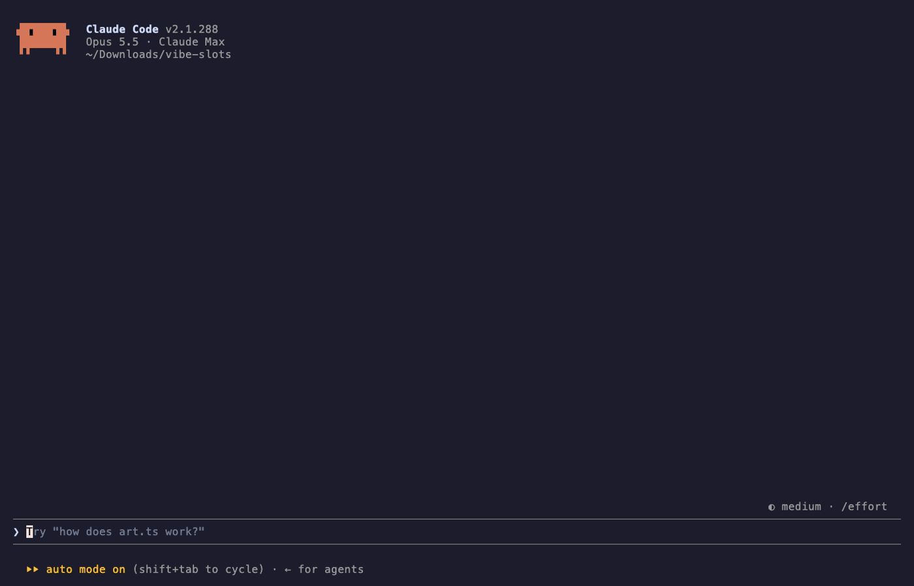
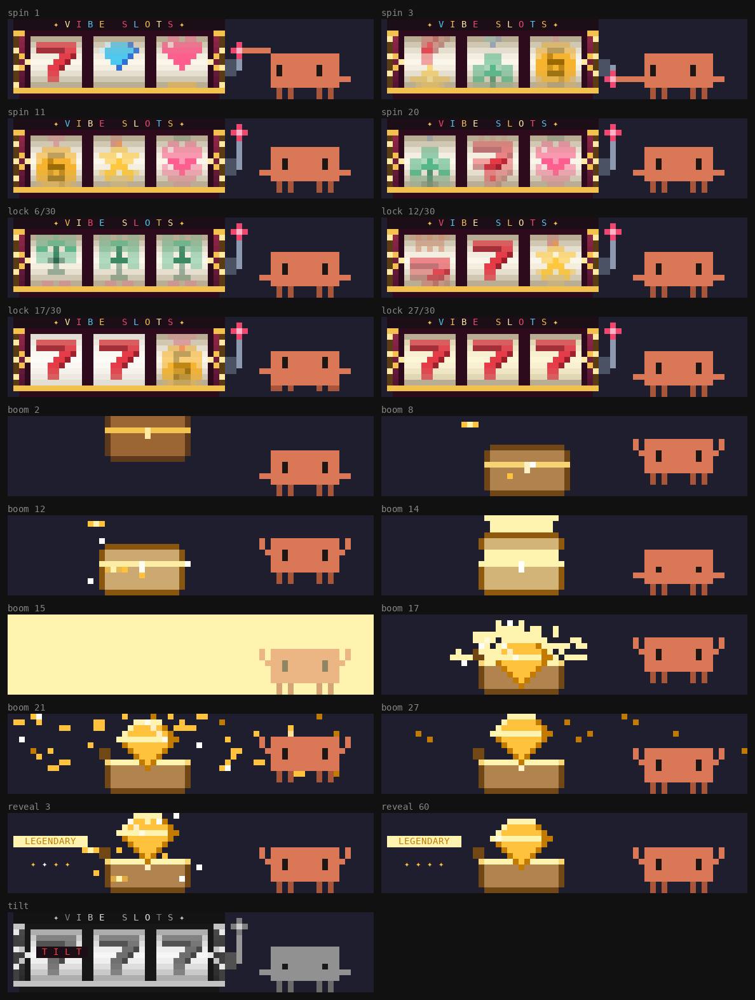
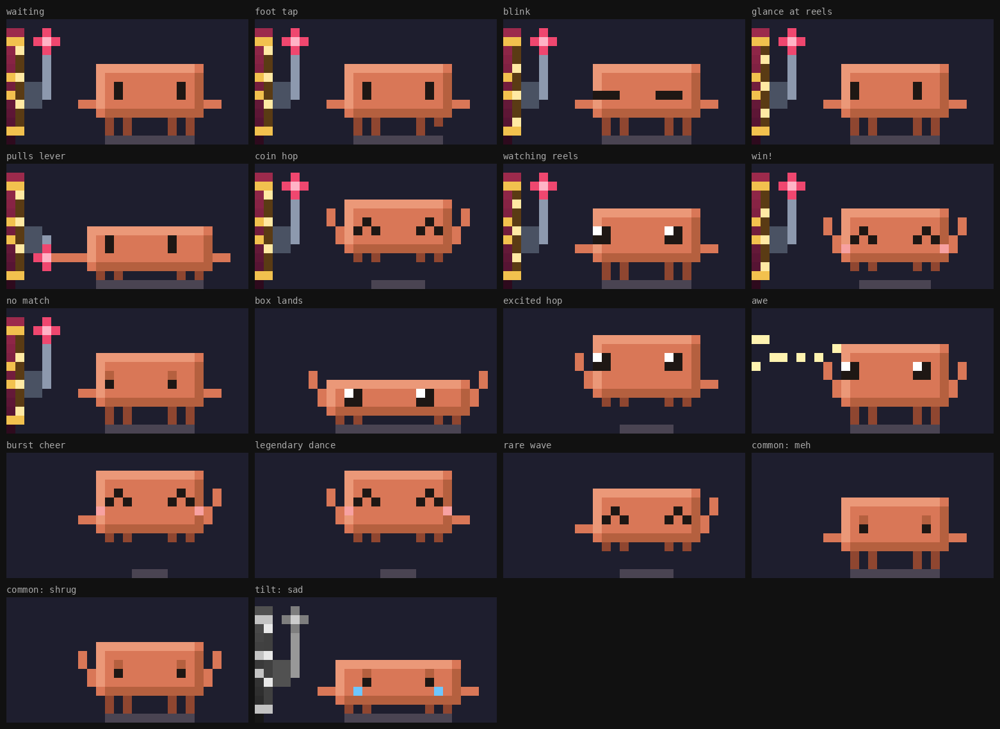

# vibe-slots

Vibe coding as a slot machine. While Claude works, a slot cabinet spins in the band above the prompt; every tool call drops another coin in. When the turn ends the reels lock one by one, a loot box rattles, glows its rarity color, cracks and explodes, and you get a prize.

In the terminal it's drawn as full-color pixel art (half-block pixels on a `Raster`): a lit marquee with chasing bulbs, reels with cylinder shading and motion blur that glide to a stop with a little overshoot, a lever Clawd actually pulls, a treasure chest that drops in, shakes, cracks with light rays, flashes and bursts into particles under gravity, and a gem that rises out of it. Desktop, and terminals with fewer than 8 free rows or 66 columns, get the text-art version.





- Clawd, the Claude Code mascot, has a whole range: taps a foot and glances at the reels while waiting, hops for every coin (tool call), hauls the lever, flinches as each reel lands, flails while the box rattles, leans back in awe as it cracks, and celebrates by rarity (a victory dance for legendary, a wave for rare and epic, an unimpressed shrug for common, a tear for TILT). Drawn procedurally in `hooks/clawd.ts` with shading, squash and stretch, and a shadow.


- Rarity: common 60%, rare 25%, epic 12%, legendary 3% (each coin adds +0.5% to legendary, capped at 10%).
- The payline matches the tier: 7-7-7 is legendary, a triple is epic, a pair is rare.
- Your stash of prizes is kept across sessions (`$.store`).
- An interrupted turn shows TILT. Short or narrow terminals get a one-line version.
- The prize clears itself after 20 seconds or on your next prompt.

Try it:

```
git clone https://github.com/alexmeckes/vibe-slots
claude --plugin-dir ./vibe-slots
```

Re-record the demo with `vhs docs/demo.tape` (needs [vhs](https://github.com/charmbracelet/vhs) and a signed-in `claude`).

Files: `hooks/pixels.ts` (the pixel scene), `hooks/clawd.ts` (Clawd), `hooks/motion.ts` (timing and reel physics), `hooks/art.ts` (loot tables and the text-art fallback), `hooks/register.tsx` (hooks and ticker), `types/index.d.ts` (state contract), `tests/slots.test.tsx`.

Check: `claude plugin validate .` and `claude plugin test .`
